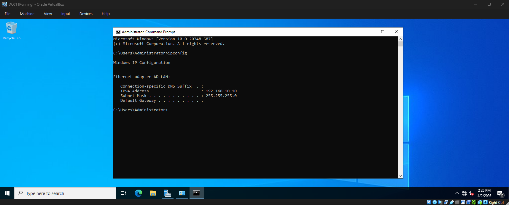
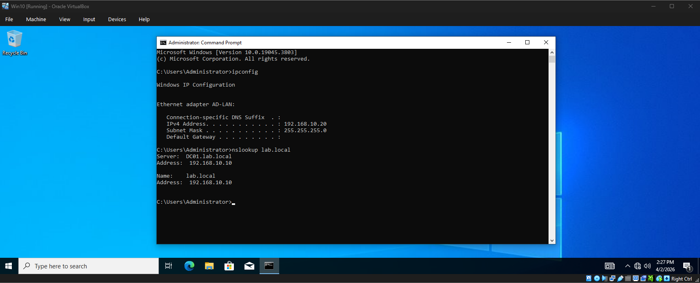
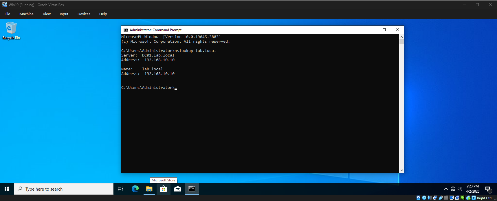
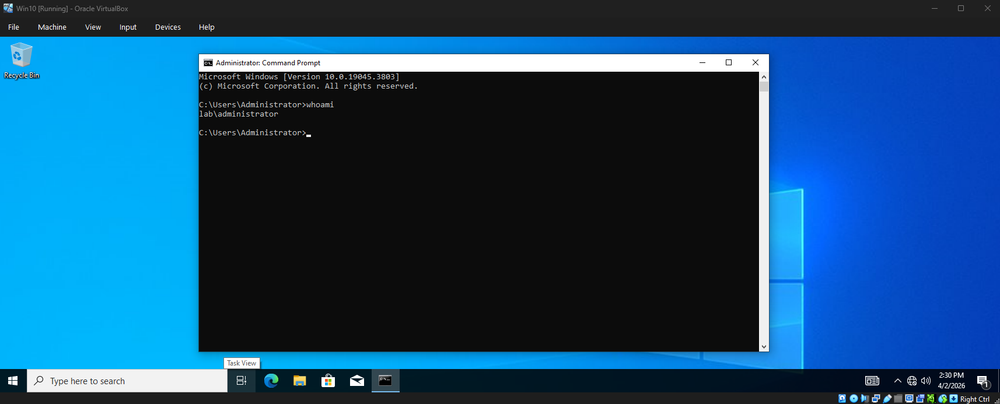
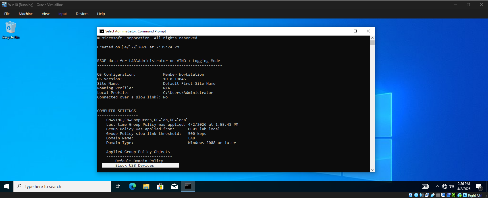
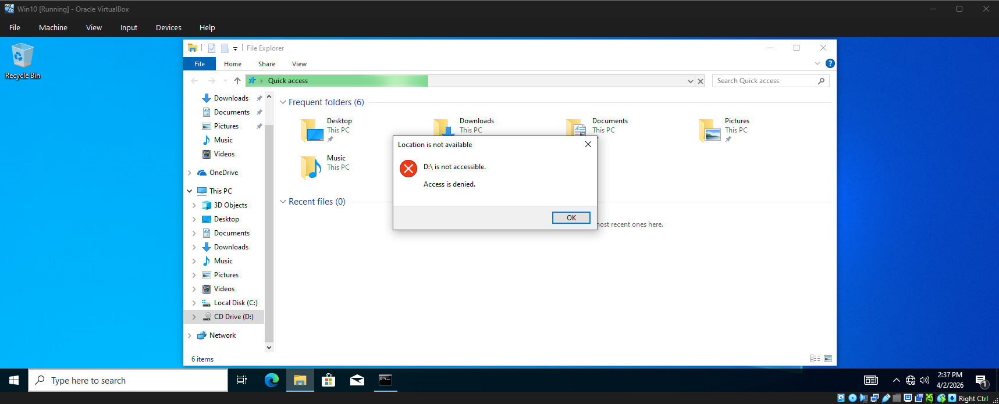
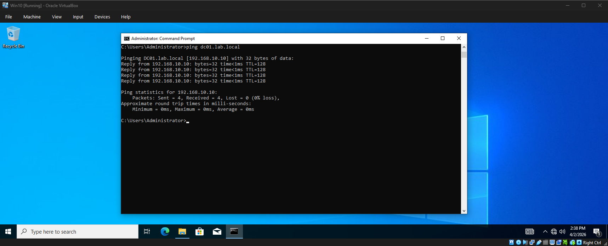

# Active Directory Home Lab

## Overview
Built a Windows Active Directory lab in VirtualBox with a domain controller, DNS, a domain-joined Windows 10 client, and Group Policy configuration.

## Environment
- Windows Server (DC01)
- Windows 10 client
- VirtualBox
- Internal network only during initial setup

## Network Configuration
- Domain: `lab.local`
- Domain Controller: `DC01` — `192.168.10.10`
- Client: `192.168.10.20`
- Client DNS: `192.168.10.10`

## What I Configured
- Installed Active Directory Domain Services
- Installed and configured DNS
- Promoted server to Domain Controller
- Joined Windows 10 client to the domain
- Logged into the client with domain credentials
- Created and applied a GPO to block removable storage

## Troubleshooting
During the build, I resolved several common Active Directory lab issues:
- Incorrect IP configuration causing APIPA addresses (`169.254.x.x`)
- DNS resolution issues preventing Group Policy from applying
- IPv6 interference with DNS resolution on the domain controller
- Time synchronization issues affecting authentication and policy processing
- VirtualBox adapter/network issues affecting client-to-DC communication

## Validation
- Successful ping from client to DC
- Successful DNS lookup for `lab.local` and `dc01.lab.local`
- Successful domain login using `LAB\Administrator`
- Group Policy applied to the domain-joined client

## Screenshots

### Domain Controller Configuration

### Client Configuration

### DNS Resolution

### Domain Login

### Group Policy Applied

### Removable Storage Blocked

### Network Connectivity Test

## Skills Demonstrated
- Active Directory administration
- DNS configuration and troubleshooting
- Group Policy management
- Windows Server administration
- Windows client domain join
- Network troubleshooting
